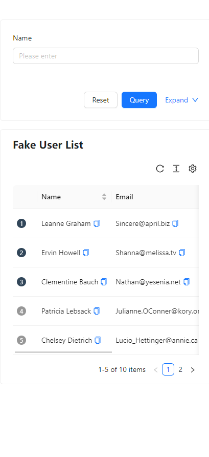
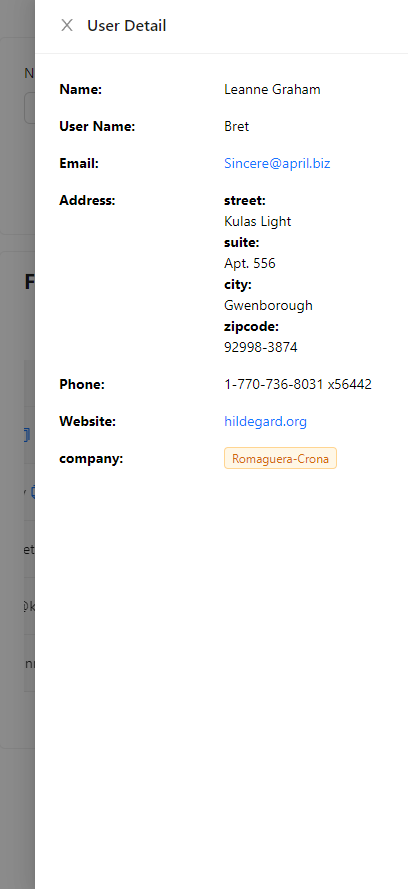

<a href="https://data-tech-test.vercel.app/">
  <h1 align="center">DataTech.TEST</h1>
</a>

<p align="center">
  Live Demo <a href="https://data-tech-test.vercel.app/"><strong>Demo</strong></a>
</p>

## Introduction

This is a very simple web application done by using React and some frameworks. The web application provides a form for displaying a range of user information. Different screen sizes are supported.

## How to run

```bash
npm i
```

```bash
npm start
```
### Frameworks

- [React.js](https://react.dev/)
- [ProComponents](https://procomponents.ant.design/) - Quick and easy component creation
- [Tailwindcss](https://tailwindcss.com/)

## Screen




